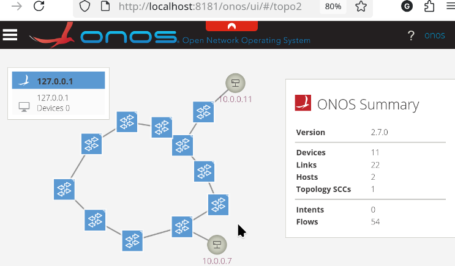
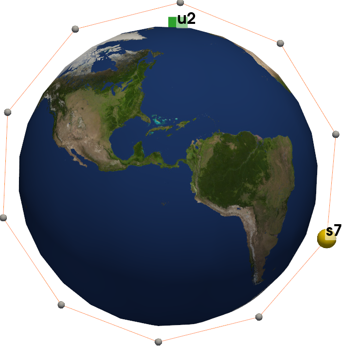

# MeteorNet

Meteornet is an open-source continuous-time emulation environment that supports all stages of a Low Earth Orbit constellation mission, from research to operational testing.
It integrates five main components:

 - **Orbital Dynamics Function**, using the SGP4 to propagate satellite trajectories and perturbations.
 - **Contact Tables**, maintaining link states and delays for handover management.
 - **Network Emulation**, built with Mininet, OpenFlow, and the ONOS controller.
 - **Containerized Services**, leveraging Docker to isolate application software and emulate real execution environment.
 - **Performance Monitoring**, with telemetry stored in a MongoDB database for offline analysis.

 ## Citation

If you use this work or build upon it, please cite the following references:

[1] C. Rojas, J. A. Fraire, F. Patrone, and M. Marchese,  
*“On the Latency Trade-off Between Space and Terrestrial Clouds in Non-Terrestrial Networks,”*  
**ASMS/SPSC 2025**, Sitges, Spain, 2025.  
DOI: [10.1109/ASMS/SPSC64465.2025.10946050](https://doi.org/10.1109/ASMS/SPSC64465.2025.10946050)

[2] C. Rojas, J. A. Fraire, F. Patrone, and M. Marchese,  
*“Fuzzy Logic-Based Orchestration of Multi-Access Edge Computing in LEO Satellite Constellations,”*  
**IEEE ICC Workshops 2024**, Denver, USA, 2024.  
DOI: [10.1109/ICCWorkshops59551.2024.10615305](https://doi.org/10.1109/ICCWorkshops59551.2024.10615305)


## Installation

These installation instructions assume an `Ubuntu` system `>22.04` version.
The code is written for python `3.11` and 
as system libraries we will use `libst` and `java`

```shell
sudo apt install build-essential default-jdk
```

Aditionaly we will use the following external libraries:

- [Docker](https://desktop.docker.com/linux/main/amd64/docker-desktop-4.21.1-amd64.deb?utm_source=docker&utm_medium=webreferral&utm_campaign=docs-driven-download-linux-amd64)
- Mininet
- [ovs-testcontroller](http://www.openvswitch.org/support/dist-docs/ovs-testcontroller.8.txt)

- [Mongodb](https://www.mongodb.com/docs/manual/tutorial/install-mongodb-on-ubuntu/)

- [Onos](https://gerrit.onosproject.org/onos)
- [Python - Miniconda](https://repo.anaconda.com)
- [sFlow-RT](https://sflow-rt.com/download.php) (Optional)
- [Comnetsemu](https://git.comnets.net/public-repo/comnetsemu) (Embedded library)

### Miniconda

The following instructions guide how to setup `miniconda` for isolated `python` environments for `3.11` and `2.7` versions. Meteornet can also use python system environments as an optional setup.
```shell
mkdir -p ~/miniconda3
wget https://repo.anaconda.com/miniconda/Miniconda3-latest-Linux-x86_64.sh -O ~/miniconda3/miniconda.sh
bash ~/miniconda3/miniconda.sh -b -u -p ~/miniconda3
rm ~/miniconda3/miniconda.sh

echo ". /home/$USER/miniconda3/etc/profile.d/conda.sh" >> ~/.bashrc
echo "conda activate" >> ~/.bashrc
```
Reboot or relogin to activate `conda` command.
Then create two python environment, on with `python2.7` and another with `python 3.11`

```shell
conda create -n satnet python=3.11
conda create -n py2.7 python=2.7
```
### MongoDB

The platform use `MongoDB` to store system variables and network mesuarements.
```shell
curl -fsSL https://www.mongodb.org/static/pgp/server-8.0.asc | \
   sudo gpg -o /usr/share/keyrings/mongodb-server-8.0.gpg \
   --dearmor

echo "deb [ arch=amd64,arm64 signed-by=/usr/share/keyrings/mongodb-server-8.0.gpg ] https://repo.mongodb.org/apt/ubuntu noble/mongodb-org/8.0 multiverse" | sudo tee /etc/apt/sources.list.d/mongodb-org-8.0.list
sudo apt update
sudo apt install -y mongodb-org
sudo systemctl enable mongod
sudo systemctl start mongod
```
Change MongoDB configuration file `/etc/mongodb.conf`to enable access from docker network

```shell
sudo nano /etc/mongodb.conf
# Edit mongodb.conf adding 172.17.0.1 ip
###################
#...
# network interfaces
net:
  port: 27017
  bindIp: 127.0.0.1,172.17.0.1
#...
####################

# Restart mongodb service
sudo systemctl restart mongod
```

### Docker

Install docker from official sources and give the correct permissions.
```shell
# Create docker group and add current user to it
sudo groupadd docker
sudo usermod -aG docker $USER
# reboot or relogin
```

### Mininet

```shell
sudo apt install mininet
```

### OVS-testcontroller

Install  `openvswitch-testcontroller` package

```shell
sudo apt install openvswitch-testcontroller

```

### Onos

For compatibility reason is recomendable to use `basel-3.7.2`. First add `bazel` repositories to be able to install version `3.7.2`
```shell
sudo apt install apt-transport-https curl gnupg -y
curl -fsSL https://bazel.build/bazel-release.pub.gpg | gpg --dearmor >bazel-archive-keyring.gpg
sudo mv bazel-archive-keyring.gpg /usr/share/keyrings
echo "deb [arch=amd64 signed-by=/usr/share/keyrings/bazel-archive-keyring.gpg] https://storage.googleapis.com/bazel-apt stable jdk1.8" | sudo tee /etc/apt/sources.list.d/bazel.list
```
Then follow the instruction below to build and run onos

```shell
# Install node
sudo apt install bzip2
sudo ln -s /home/scnl/miniconda3/envs/py2.7/bin/python2.7 /usr/bin/python
# Instruction based on https://wiki.onosproject.org/display/ONOS/Developer+Quick+Start
# Install bazel-3.7.2 adding their repository as instructed in https://bazel.build/install/ubuntu#install-on-ubuntu
sudo apt install bazel-3.7.2

# outside project folder
cd ..
git clone https://github.com/opennetworkinglab/onos
cd onos
git checkout 2.7.0
conda activate py2.7

# Addd onos bash profile to .bashrc file or source onos.bashrc
# export ONOS_ROOT="<onos_path>"
# source $ONOS_ROOT/tools/dev/bash_profile
# export ONOS_APPS="$ONOS_APPS,fwd"

bazel-3.7.2 build onos
bazel-3.7.2 run onos-local -- clean
```
Enter to onos [ui page](http://localhost:8181/onos/ui/login.html), with `user:onos`, `pass:rocks` and enable Reactive Forwarding.

### Python requirements
Activate python 3.11 envorinment `conda activate satnet`

```
pip install -r requirements.txt
```

### sFlow-RT (Optional)
```shell
# inside project folder
cd satellite_constellation
wget https://inmon.com/products/sFlow-RT/sflow-rt.tar.gz
tar -xvzf sflow-rt.tar.gz
sudo apt install default-jre
```

## Running Emulations

Before running a constellation we must build the docker images with the software under test and generate TLEs for satellites orbits.  

```shell
## Build containers
cd containers
python3 build.py
cd ..
## Generate TLEs
cd tles/constellation_tles
bash TLE_Generation.sh
```

The base setup of meteornet assumes at least mongodb and ovs installed and running as services.

```shell
systemctl start mongod
systemctl start ovs-vswitchd
systemctl start ovsdb-server
```

The next command run an emulation of 4 sattelites and 3 user equipment locations with 200 devices each, sending taks at a rate of 2 tasks per minute per device. 
This configuration uses docker and ovs-testcontroller SDN.

```shell
# Asumes a mongodb installed and running as a service and and ovs-testcontroller executable
./python_sudo.sh main.py --sats "7 8 9 10"  -s 300  -d --step 30 --gnds 2 --devices 20 --sat_servers "7"
```
The emulation creates docker containers for the satellite ('st7h') user ('gn2h') hosts and generate tasks sent from the only server on.
The results of task computations are stored in the MongoDB `sat_net` and it is posible to access host consoles using docker.

```shell
# List docker containers
docker ps
# Attach a terminal to a container
docker exec -it gn2h /bin/bash

# In container terminal ping satellite st7h (IP:10.0.0.7)
ping 10.0.0.7
```

While ovs-testcontroller is a handly SDN controller designed for small testcases, it cannot handles loops on the network.
A production-grade SDN controller---like ONOS---should be used to manage bigger constellations.
The next command run a single orbital ring of 10 satellites using onos SDN controller in background.

```shell
# source and run onos in separate console
source onos.bashrc
cd ../onos
bazel run onos-local -- clean
# then in another terminal run the constellation
./python_sudo.sh main.py --sats 10  -s 300  -d --step 30 --gnds 2 --devices 20 --sat_servers 7 -r
```
During the execution the constellation graph is shown in onos localhost page.

<center>

</center>

The scripts `run_constellation.sh` and `run_multiple_const.sh` reproduce bigger constellions and long multiple executions for replicate the data used in research papers.
These scripts automatically remove orphans from last execution and start parallel onos controller using `screen` command.

```shell
# Run a starlink like constellation 
bash run_constellation.sh
# Run multiple constellations and store measurements in ./data/sims folders
bash run_multiple_const.sh
```

If and execution fails unexpectelly is useful to clean last execution docker and network interfaces.

```shell
./python_sudo.sh main.py -c 
```

## Plot Constellations
Plot the constellation with `pyvista` and `Qt`

```shell
# Plot 10 sattelites
export QT_QPA_PLATFORM="xcb" && python3 -m  plots.constellation --sats 10 --gnds 2 --sat_servers 7
```
<center>

</center>

## Troubleshooting

### Mongodb Configuration

Add docker host ip to mongodb configuration file `/etc/mongodb.conf`

```
...
bindIp: 127.0.0.1,172.17.0.1
...
```
Then restart mongodb services `systemctl restart mongod`


### Mesa LD_PRELOAD
To avoid *.so shared libraries not fount by MESA-LOADER in ubuntu 22.04, 
add the following line to `.bashrc`

```sh
export LD_PRELOAD=/usr/lib/x86_64-linux-gnu/libstdc++.so.6
```


